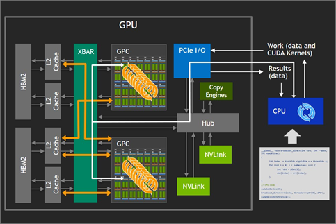
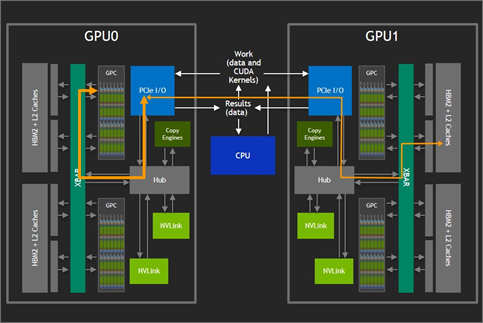
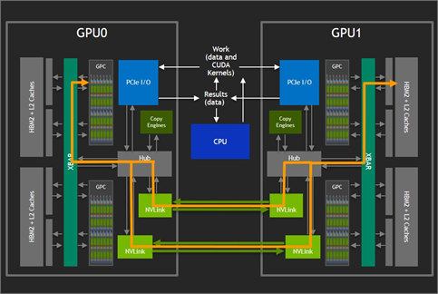

# NVLink

在传统的 GPU 与 CPU 交互时，数据通过 PCIe 传输到 GPU 中，随后由 GPU 驱动程序将数据分配给各个可用的 Graphics Processing Clusters(GPC)和Streaming Multiprocessor (SM)。XBAR 用于 GPU/SM 核心能够在 L2 缓存以及高带宽的 GPU 内存(HBM2)之间进行数据交换。为了有效利用 XBAR 所提供的巨大带宽，数据必须能够被存储在本地 GPU 内存中。

在增加一张 GPU 卡之后，各 GPU 只能以 PCIe 所支持的的最大双向带宽来访问另一张 GPU 上的内存。此外，这些操作还会与 CPU 在总线上的操作相互竞争，从而进一步减少了可用的带宽。

为了能够进一步扩展 GPU 之间的互联能力，NVIDIA 开发了 NVIDIA NVLink，使得 GPU 集群能够直接访问远程 GPU 的内存，而无需通过 PCIe 总线来传输数据。通过 NVLink，GPU 之间可以更加高速的访问其他 GPU 的内存。

| NVLink Gen | GPU Architecture (Year) | Link Speed | Links per GPU | Total Bandwidth (GB/s, bidirectional) | Notes / Features |
|------------|--------------------------|------------|---------------|---------------------------------------|------------------|
| NVLink 1.0 | Pascal P100 (2016) | 20 GB/s (per link per direction) 40 GB/s (bidirectional) | 4 | 160 GB/s | First NVLink; enables GPU–GPU and GPU–CPU (Power8) links; used in early NVLink-CPU systems (IBM POWER8). |
| NVLink 2.0 | Volta V100 (2017) | 25 GB/s (Tx), 25 GB/s (Rx) 50 GB/s bidirectional | 6 | 300 GB/s | Added cache coherence and unified address; supported by IBM POWER9; Tesla V100: 6 links. |
| NVLink 3.0 | Ampere A100 (2020) | 50 GB/s per direction per link | 6 | 600 GB/s | A100: Ampere's GPU (third-gen NVLink); ~2× bandwidth of V100; used in DGX A100, NVIDIA HGX. |
| NVLink 4.0 | Hopper H100 (2022) | 50 GHz (100 GB/s per direction per link) | 12 | 900 GB/s | H100: 4th-gen NVLink; triple PCIe Gen5 speed; enables NVLink Switch System and NVLink network. |
| NVLink 5.0 | Blackwell B200 / GB200 (2024–25) | 100 GB/s per link per direction | 18 | 1,800 GB/s | GB200 NVL72: 72 GPUs + 36 Grace CPUs per rack; 130 TB/s system bandwidth; supports up to 576 GPUs in non-blocking fabric. |
| NVLink 6.0 | Rubin (2026) | 3,600 GB/s per GPU (2× NVLink 5) | TBD | 3,600 GB/s | Vera Rubin NVL72: 72 Rubin GPUs + 36 Vera CPUs; 260 TB/s rack bandwidth; up to 10× inference cost reduction vs Blackwell; expected H2 2026. |