# NVLink 1.0

在 2014 年，NVIDIA 就在其白皮书中介绍过 NVLink，如下图所示，最初给出的配置方案中包括 1 个 CPU 、2 个 GPU，2个 GPU 之间可以通过 NVLink 进行高速互联，峰值带宽可以达到 80GB/s（实际有效带宽按照 80% 计算，64GB/s）

第二种配置方案中，每组包含4块 GPU，4 块 GPU 之间可以有1条或者2条NVLINK连接

下图给出了在多个 GPU 进行数据交换和排序时，使用 PCIe 和 NVLink 的速度差距

下图使用 3D FFT算法时，使用 PCIe 和 NVLink 的速度差距

在 2016 年 hcs 会议上，NVIDIA 比较详细的介绍了 NVLink，和 PCIe 类似，分为 事务层 TL、链路层 DL、物理层 PHY。

## Transaction Layer

TL 层负责处理 synchronization、 link flow control、 multiple link aggregate，同时还支持 virtual channel。

NVLink 使用可变长度的数据包，其包结构如下所示，128bit 的 Header Flit 中包括 CRC、DL header、TL Header。Address Extension Flit中包含了多个命令可能使用到的信息。Byte Enable Flit根据需要选择是否添加，以及可选的 0-16 个 data payload flits。因此，一个数据包的大小可能是 1-18 个 Flit 。

Packet header中会包括 packet length的信息

## Data Link Layer

数据链路层主要负责数据包在链路上的可靠传输，使用 25bit CRC 进行保护。已发送的数据包会暂存在 replay buffer 中，直到收到链路另一端发出的 ACK 。如果 DL 层检测到 CRC 错误，就不会发送 ACK，并准备接收重传的数据；发送方如果未收到 ACK，就会触发超时重传机制，并从 replay buffer中重新发送数据，直到接收到 ACK 之后才会将其从 replay buffer 中移除。

25bit CRC 可以检测出最多 5bit 的随机错误，或者不超过 25bit 的突发错误。

CRC 的计算包括当前的 header、之前的 payload （用于尽快释放packet length信息）。 

如下图所示，其中每一个 Flit 都有一个自己的 SEQ ID，绿色和红色分别对应2个 CRC 的计算范围。如果发生错误，则从最后一个 ACKed 的数据包开始重传

## PHY

在物理层上，NVLink 使用 NVIDIA 自研的  High-Speed Signaling (NVHS) ，每对差分对速率为 20 Gbps，NRZ 编码，双向传输速率 40 Gbps，所以一个 x8 的 block 包括有 16 根线。最早推出的 Pascal 系列上包括有 4 个 NVLink。

和一般的 serdes 类似，物理层负责 deskew（across all eight lanes），framing (figuring
out the start of each packet), scrambling/descrambling (to ensure adequate bit transition density to support clock recovery), polarity inversion, lane reversal，并将数据交给数据链路层

在芯片（P100）内部，数据以 1.25 GHz的速率从 PHY 传输至 NVLink 控制器

NVLink 其他的参数如下

- Embedded clock 
- 86 Ohm terminated
- DC coupled
- Bit Error Rate 1e-12
- -22dB insertion loss (PCB 15'')
- Polarity inversion
- Lane reveral

## Example

下图给出了一个简单的读请求示例，Requestor 发送 128bit 的读请求，包括有 25 bit CRC、83 bit Read req header、20 bit DL Header，Target 响应包括 128B Read Resp Header，和 4 个 Flit 的Data Payload。

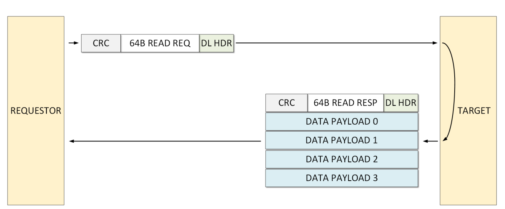

## Efficiency

受 Header、CRC 、 ACK 等的影响，不同 Data Transfer Size下的效率不同，如下所示，256B 时可以达到约 94% 的效率

## Topology

NVIDIA 给出了通过 NVLink 进行连接的多种拓扑方式，包括有 GPU - GPU 之间的

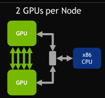

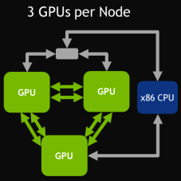

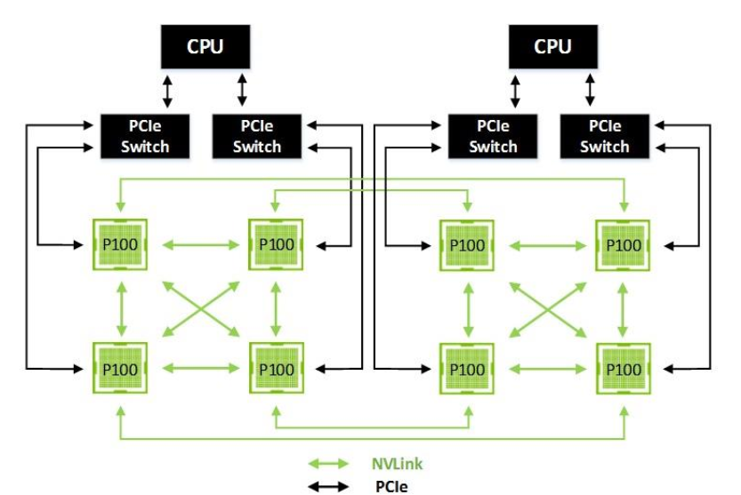

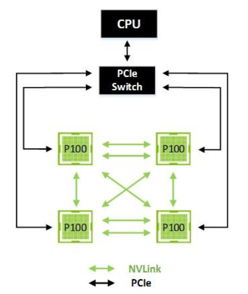

CPU - GPU 之间的

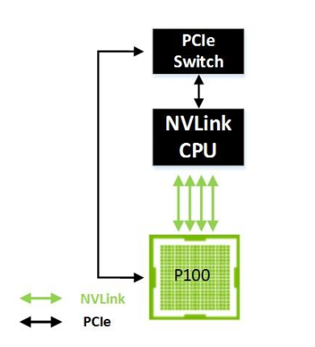

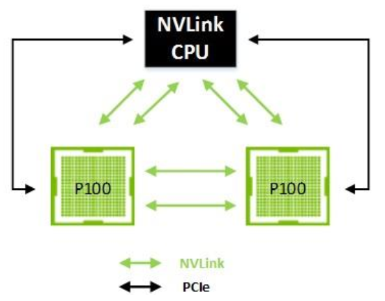

## P100

P100 是 NVIDIA 推出的首个搭载 NVLink 的显卡，其结构如下。最下方包括 4 个 NVLink，挂在 High-Speed Hub 上

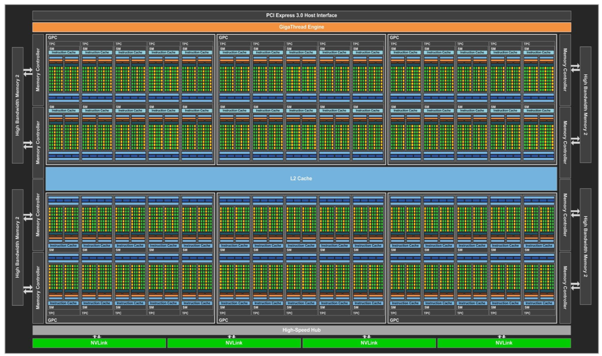

下面是 Pascal P100 的 die shot，从 P100 白皮书中的框图推测，其中左上角部分应该就是 4 组 NVLink

P100 配备了两个 400 引脚的高速连接器：其中一个用于模块的 NVLink 信号输入/输出，另一个则用于提供电源、控制信号及 PCIe I/O 接口。Tesla P100 加速器可安装在大型 GPU 载板或系统主板上；通过 GPU 载板，它可以与其他 P100 加速器或 PCIe 控制器建立相应的连接。

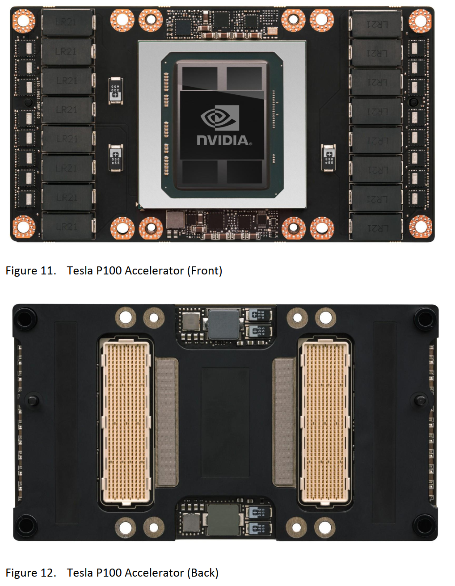

在 GPU 架构接口层面，NVLink 控制器通过一个名为High-Speed Hub（HSHUB）的模块与 GPU 内部进行通信。HSHUB 可直接访问 GPU-wide crossbar（crossbar）及其他系统组件（如 High-Speed Copy Engines， HSCE），从而支持 NVLink 以最大速率在 GPU 之间进行数据传输。

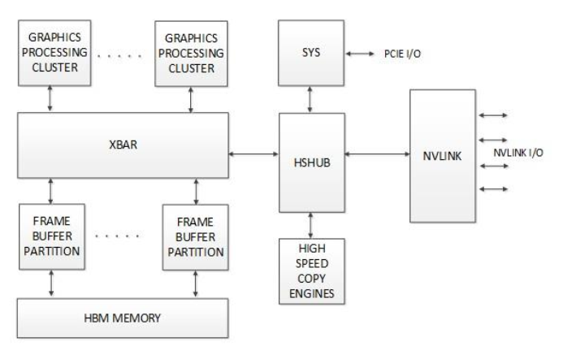

## DGX-1

DGX-1 是 NVIDIA 首个推出的用于深度学习的系统，它由 8 个 Tesla P100 组成，这些 GPU 通过 hybrid cube-mesh 的拓扑方式、使用 NVLink 进行连接，如下图所示

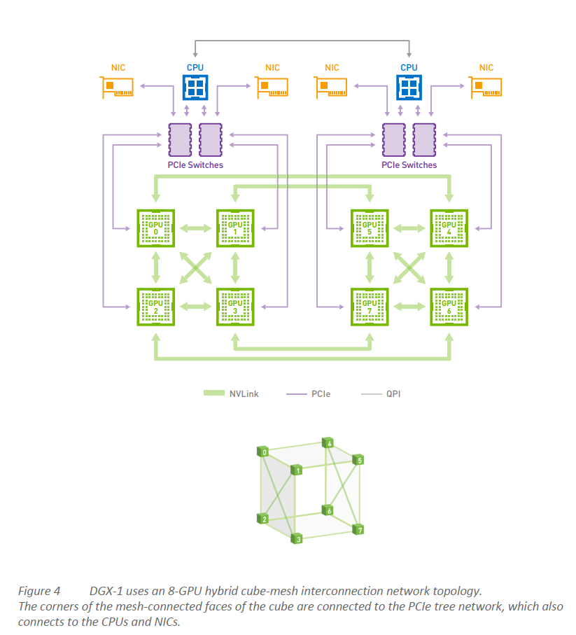

同时，为了扩展到更多的系统，DGX-1 还可以通过 InfiniBand（IB）连接到更多的机器。

2015年的时候，NVIDIA 就开始开发 NCCL ，并在年底的时候开源。在 DGX-1 上， hybrid cube-mesh 更适合 NCCL 的方法。 hybrid cube-mesh 中可以看到有 2 个环，如下图所示，其中深色和浅色是两个环。在集合通信时，两个环可以无阻塞的完成数据交换，最大限度地利用带宽。

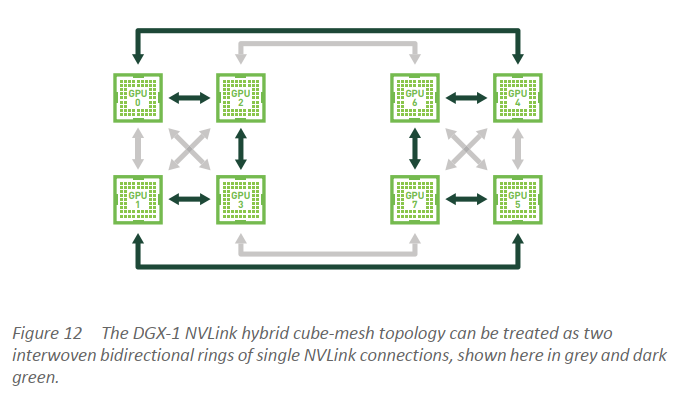

## Power System S822LC 

S822LC 是 IBM 推出的搭载 NVLink 的系统，其系统结构如下。每个 POWER 8 处理器包括有 2个 NVLink，可以直接与 P100 相连。

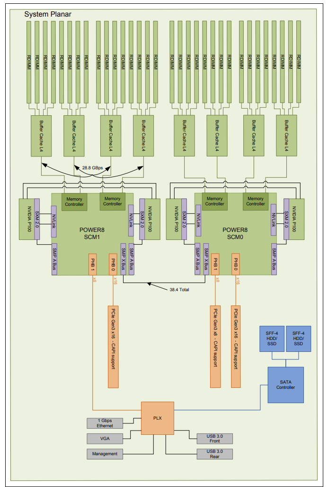

虽然现在有了 NVLink，但是所有 GPU 的初始化还是通过 PCIe 接口进行的，PCIe 还负责状态、电源管理等的一些带外通信。GPU 启动后，所有数据通信都使用 NVLink。

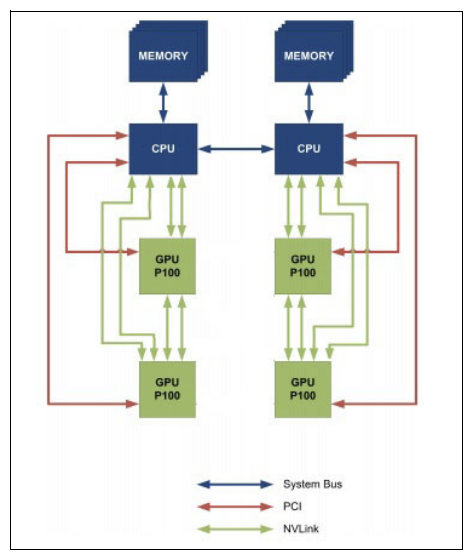

