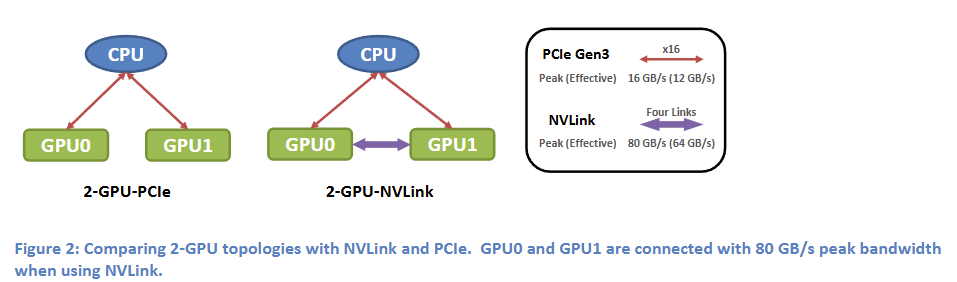
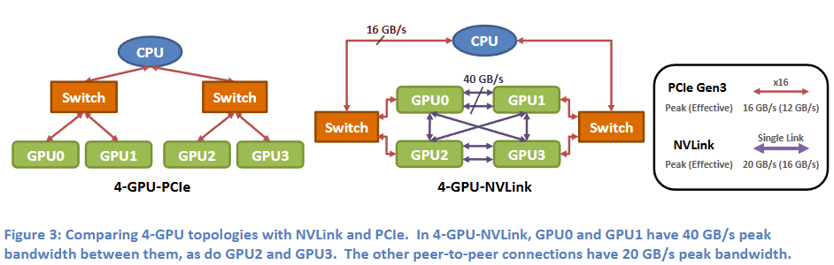
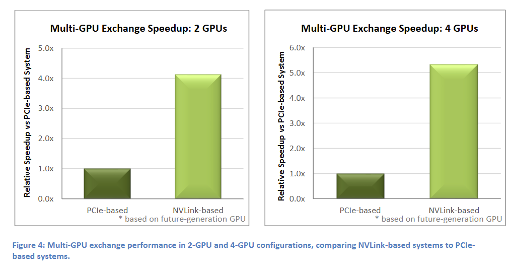
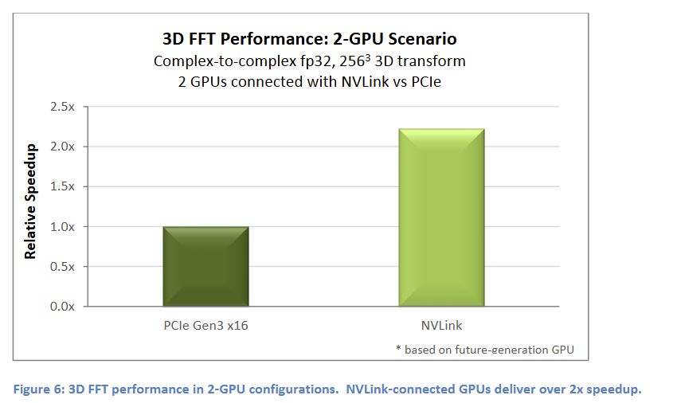
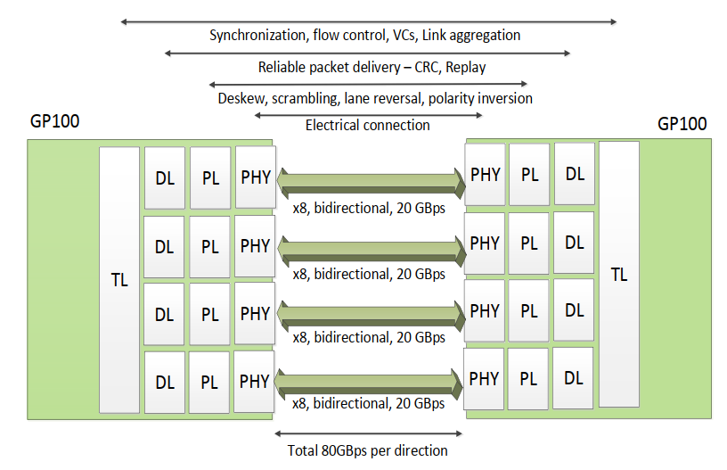
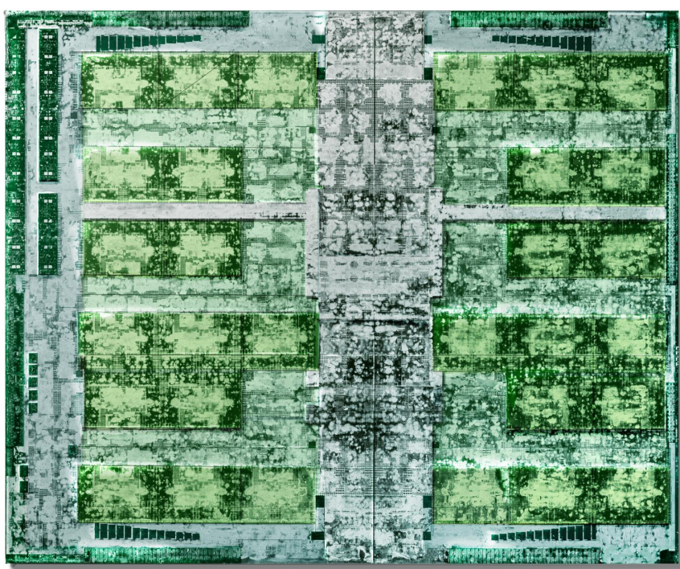
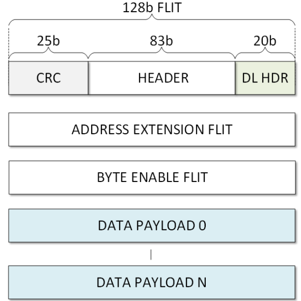
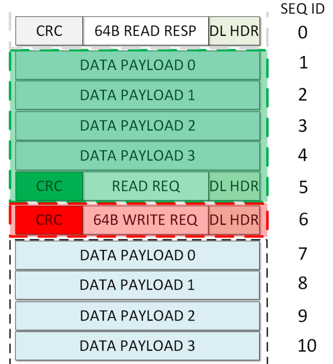
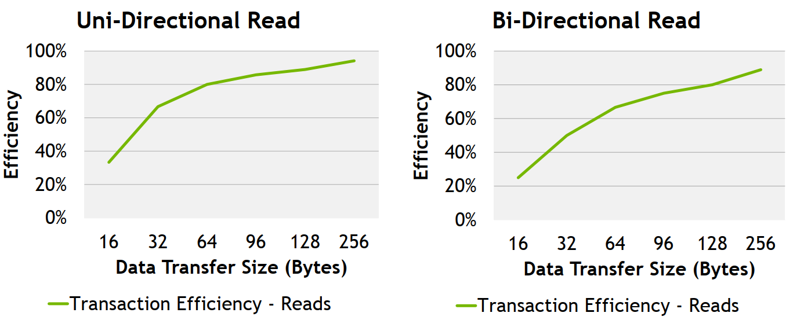

# NVLink 1.0

在 2014 年，NVIDIA 就在其白皮书中介绍过 NVLink，如下图所示，最初给出的配置方案中包括 1 个 CPU 、2 个 GPU，2个 GPU 之间可以通过 NVLink 进行高速互联，峰值带宽可以达到 80GB/s（实际有效带宽按照 80% 计算，64GB/s）

第二种配置方案中，每组包含4块 GPU，4 块 GPU 之间可以有1条或者2条NVLINK连接

下图给出了在多个 GPU 进行数据交换和排序时，使用 PCIe 和 NVLink 的速度差距

下图使用 3D FFT算法时，使用 PCIe 和 NVLink 的速度差距

在 2016 年 hcs 会议上，NVIDIA 比较详细的介绍了 NVLink，和 PCIe 类似，分为 事务层 TL、链路层 DL、物理层 PHY。

下面是 Pascal GP100 的 die shot，从 GP100 白皮书中的框图推测，其中左上角部分应该就是 4 组 NVLink

## Transaction Layer

TL 层负责处理 synchronization、 link flow control、 multiple link aggregate，同时还支持 virtual channel。

NVLink 使用可变长度的数据包，其包结构如下所示，128byte 的 Header Flit 中包括 CRC、DL header、TL Header。Address Extension Flit中包含了多个命令可能使用到的信息。Byte Enable Flit根据需要选择是否添加，以及可选的 0-16 个 data payload flits。

Packet header中会包括 packet length的信息

## Data Link Layer

数据链路层主要负责数据包在链路上的可靠传输，使用 25bit CRC 进行保护。已发送的数据包会暂存在 replay buffer 中，直到收到链路另一端发出的 ACK 。如果 DL 层检测到 CRC 错误，就不会发送 ACK，并准备接收重传的数据；发送方如果未收到 ACK，就会触发超时重传机制，并从 replay buffer中重新发送数据，直到接收到 ACK 之后才会将其从 replay buffer 中移除。

25bit CRC 可以检测出最多 5bit 的随机错误，或者不超过 25bit 的突发错误。

CRC 的计算包括当前的 header、之前的 payload （用于尽快释放packet length信息）。 

如下图所示，其中每一个 Flit 都有一个自己的 SEQ ID，绿色和红色分别对应2个 CRC 的计算范围。如果发生错误，则从最后一个 ACKed 的数据包开始重传

## PHY

在物理层上，NVLink 使用 NVIDIA 自研的  High-Speed Signaling (NVHS) ，每对差分对速率为 20 Gbps，NRZ 编码，双向传输速率 40 Gbps，所以一个 x8 的 block 包括有 16 根线。最早推出的 Pascal 系列上包括有 4 个 NVLink。

和一般的 serdes 类似，物理层负责 deskew（across all eight lanes），framing (figuring
out the start of each packet), scrambling/descrambling (to ensure adequate bit transition density to support clock recovery), polarity inversion, lane reversal，并将数据交给数据链路层

NVLink 其他的参数如下

- Embedded clock 
- 86 Ohm terminated
- DC coupled
- Bit Error Rate 1e-12
- -22dB insertion loss (15'')
- Polarity inversion
- Lane reveral

## EFFICIENCY

受 Header、CRC 等的影响，不同 Data Transfer Size下的效率如下所示

