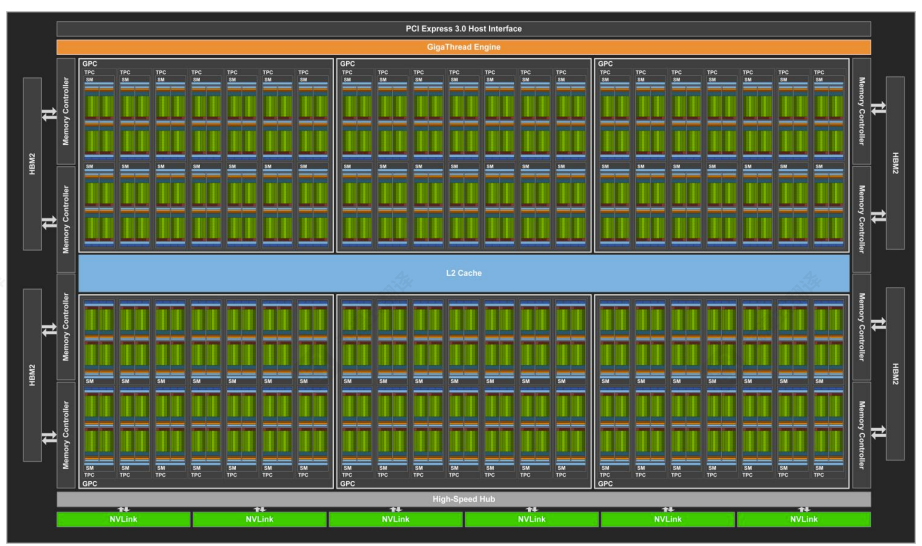
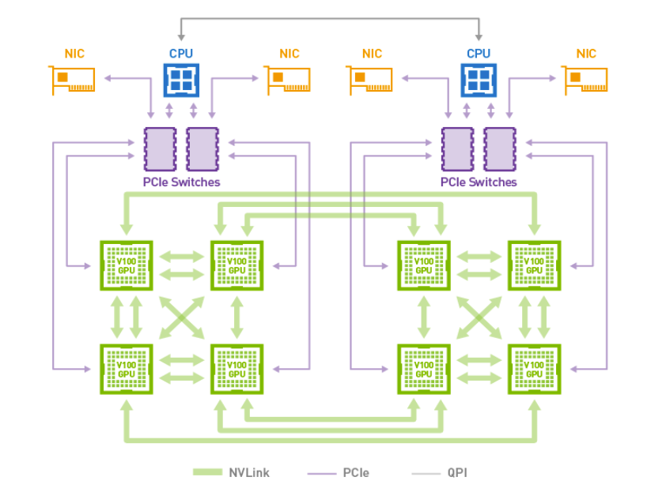
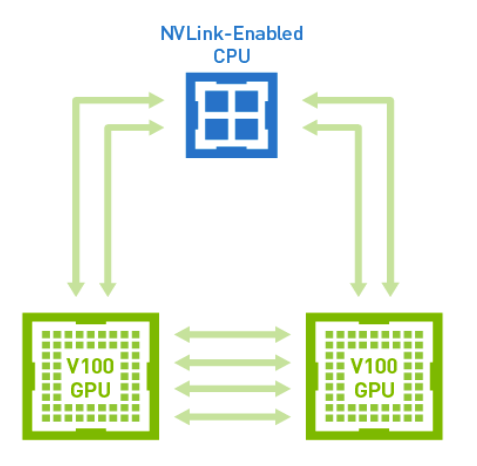

# NVLink 2.0

2017 年 NVIDIA 发布了 Tesla GV100 ，引入了第二代 NVLink，这个版本在链路速度、单 GPU 链路数量、CPU 主控能力、缓存一致性以及可扩展性方面均有所提升。

Volta GV100的硬件架构图如下，6 组 NVLink 仍然通过 High-Speed Hub 访问片内数据

## 和 NVLink 1 的区别

| 指标 | NVLink 1.0 (Pascal GP100) | NVLink 2.0 (Volta GV100) |
|------|--------------------------|--------------------------|
| 每对差分线信号速率        | 20 Gbps   | **25 Gbps** |
| 每个 sub-link 的差分对数  | 8 对      | 8 对 |
| 每条链路单向带宽        | 20 GB/s   | **25 GB/s** |
| 每条链路双向带宽          | 40 GB/s   | **50 GB/s** |
| 单 GPU 最大链路数         | 4         | **6** |
| 单 GPU 聚合双向总带宽     | 160 GB/s  | **300 GB/s** |
| 编码方案                  | NRZ       | NRZ（8×25 Gbaud） |
 

NVLink 2.0 在保持相同差分对结构的前提下，将信号速率从 20 Gbps 提升至 25 Gbps，同时将每颗 GPU 的链路数从 4 条增加到 6 条，聚合带宽整体翻近两倍。

在数据链路层、事务层等方面，NVIDIA 没有做更多的介绍。

## More Features

### Unified memory

CUDA 6 在 Kepler 和 Maxwell 架构 GPU 中引入了有限形式的统一内存（Unified Memory），随后在 Pascal GP100 GPU 中通过硬件页面错误处理（hardware page faulting）和更大的地址空间对其进行了改进。Pascal GP100 中的统一内存实现了数据在 GPU 和 CPU 完整虚拟地址空间之间的透明传输。

Volta GV100 进一步提升了统一内存的效率与性能，新增的 Access Counter 功能可追踪 GPU 访问位于其他处理器上的内存的频率。Access Counter 有助于确保将内存页移动到访问频率最高的处理器所对应的物理内存中。这个功能既适用于通过 NVLink 或 PCIe 连接的 GPU-CPU 架构，也适用于 GPU-GPU 架构，并支持包括 Power 9、x86 等在内的多种类型的 CPU。

###  Address Translation Services (ATS) 

V100 支持通过 NVLink 传输 Address Translation Services (ATS)。当 GPU 的 MMU 发生地址转换 miss 时，会向 CPU 发送 Address TranslationRequest（ATR）；CPU 随后在其页表中查找该地址对应的虚拟地址到物理地址的映射，并将转换结果返回给 GPU。ATS 赋予了 GPU 访问 CPU 内存的完整权限，例如访问通过 `malloc` 直接分配的内存。

## DGX-1 with V100

相比于 P100 ，V100 增加了 2 个 NVLink，因此互联结构也发生了变化，但仍然是 Hybrid Cube Mesh Topology，如下图

很显然，增加了 2 组 NVLink 之后，现在的 Hybrid Cube Mesh Topology 支持三个环可以并行无阻塞的传输数据。

CPU - GPU互联方式如下

## NVSwitch