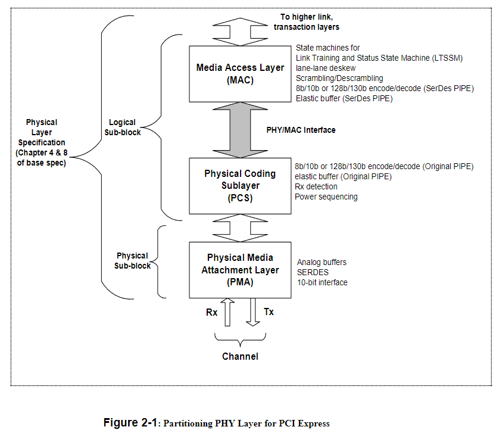
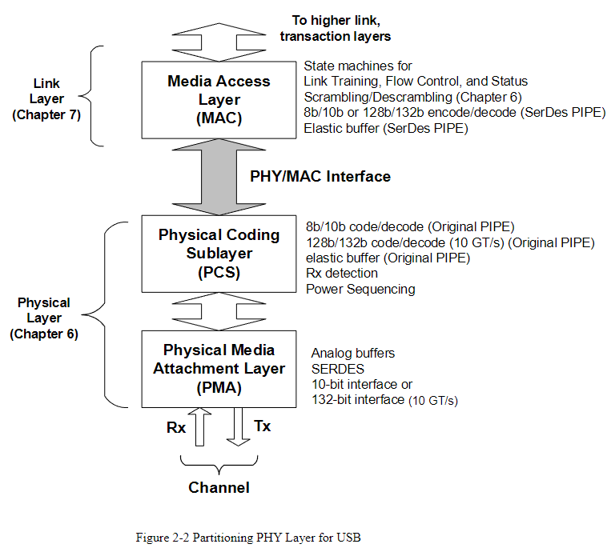
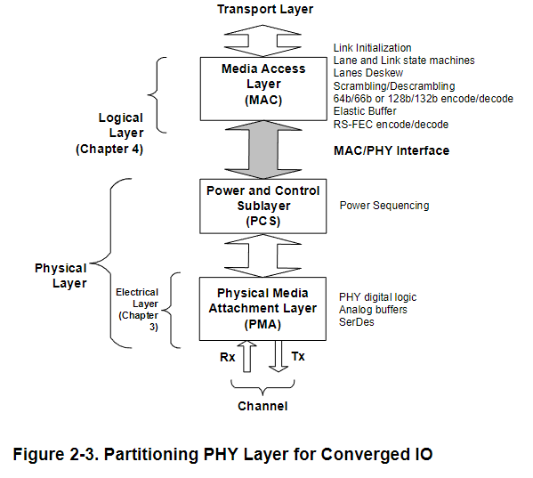

# 2. Introduction

PIPE`(The PHY Interface for the PCI Express, SATA, USB, DisplayPort and Converged IO Architectures)`的物理层接口旨在支持开发功能等效的 PCI Express、SATA、USB、DisplayPort 和 Converged I/O PHY。此类 PHY 可作为 独立集成电路（IC）提供，也可作为 macrocell 集成到 ASIC 设计中。本规范定义了一组符合 PIPE 标准的 PHY 必须实现的功能，并定义了此类 PHY 与介质访问层 (MAC) 及链路层 ASIC 之间的标准接口。本规范的目的不是定义符合标准的 PHY 芯片或 macrocell 的内部架构或设计。PIPE 规范的制定旨在允许采用多种方法实现。在可能的情况下，PIPE 规范会引用 PCI Express 基础规范、SATA 3.0 规范、USB 3.1 规范、DisplayPort 1.4 规范或 Converged IO 1.0 规范，而非重复其内容。若出现冲突，PCI-Express 基础规范、SATA 3.0 规范、USB 3.1 规范、DisplayPort 1.3 规范以及Converged IO 1.0 规范应优先于 PIPE 规范。

本规范阐述了 MAC 如何在多种 LTSSM 状态、链路状态及其他协议中使用 PIPE 接口的相关信息。这些信息应被视为基础规范要求的实现指南或其中一种实现方式。只要满足相应规范要求，MAC 的具体实现可采用其他方案。

PIPE 规范的设计目标之一，是加速 PCIe EP、SATA 设备、USB 设备以及 Converged IO 设备的开发进程。本文档定义了一套可供 ASIC 与 endpoint device 厂商基于其进行开发的接口。外设与 IP 厂商可在不受 PCIe、SATA、USB、DisplayPort 或Converged IO PHY 接口相关的高速及模拟电路问题影响的前提下，开展设计开发与验证工作，从而缩短开发周期并降低研发风险。

PIPE 规范为该接口定义了两种时钟方案。第一种方案中，PHY 提供一个时钟信号（PCLK），作为输出时钟来驱动 PIPE 接口。第二种方案中，PCLK 作为输入信号提供给 PHY 的每一条通道。将 PCLK 作为输入提供给 PHY 每条通道的这种方案，是在 PIPE 规范4.1 版本中新增的。**它使得 PHY 外部的控制器或逻辑电路能够更简便地调整 PIPE 接口的时序，以满足芯片实现中的时序要求。**PHY 仅需支持其中一种时序方案即可。这两种时钟方案应分别称为 **“PCLK as PHY Output”和“PCLK as PHY Input”**。DisplayPort 仅支持 **“PCLK as PHY Input”** 这一时钟方案。注意：PCIe 5.0 及后续版本、Converged IO以及 DisplayPort 均不支持 “PCLK as PHY Output” 模式。

图 2‑1：PCI Express 物理层（PHY Layer）划分，展示了本规范针对PCI Express 基础规范所描述的划分方式。

图 2‑2 展示了本规范针对USB 3.1 规范所描述的划分方式。

图 2‑3 展示了本规范针对Converged IO 1.0 规范所描述的划分方式。

