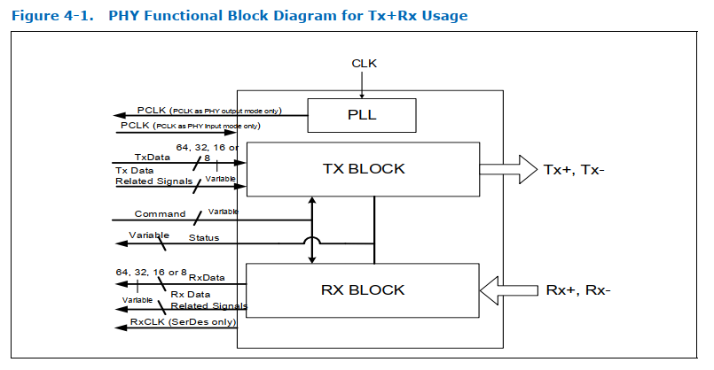
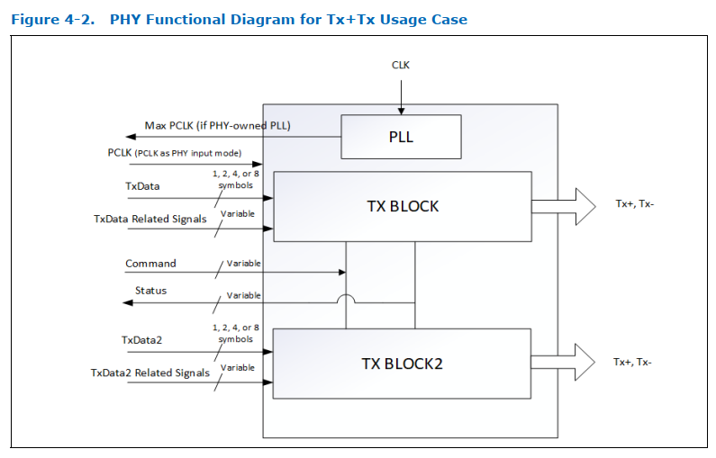
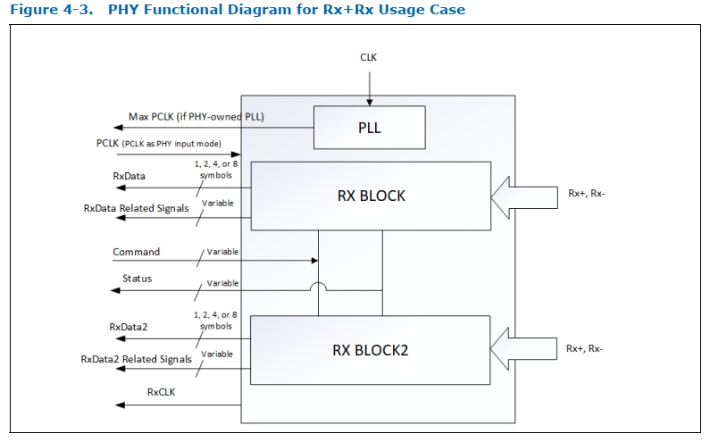
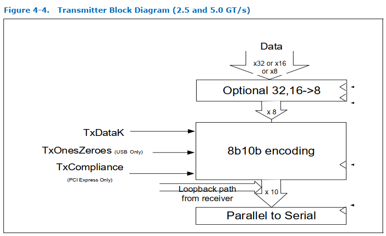
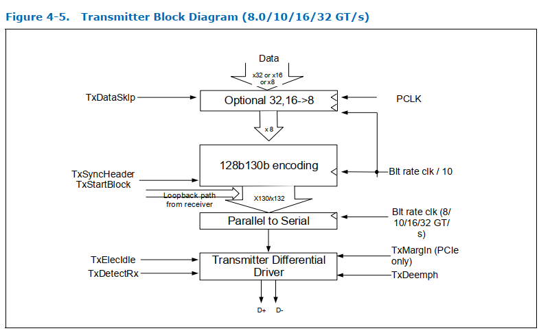
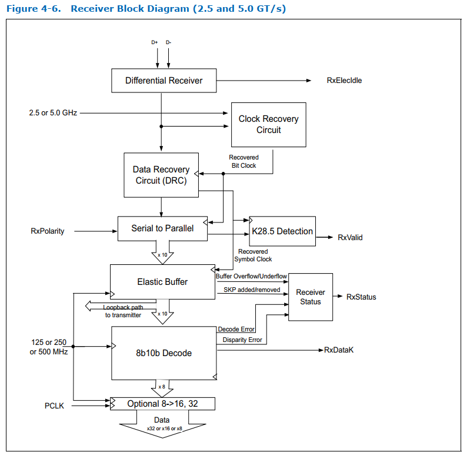
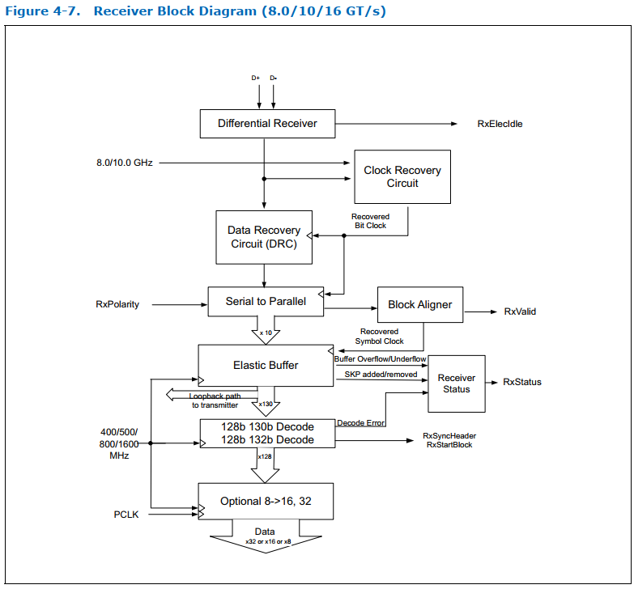
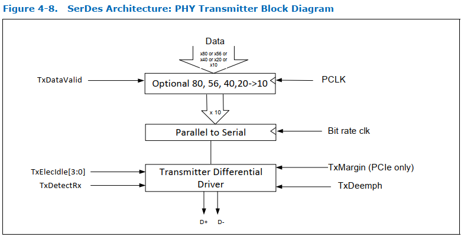
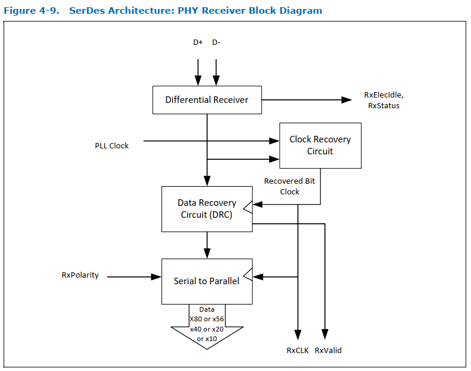

# 4. PCIe, USB, USB4, and DisplayPort PHY Functionality

图 4-1 展示了由一对 Tx 差分信号和一对 Rx 差分信号组合而成的 PHY 功能框图。图中所示的功能模块并非用于定义符合规范的 PHY 的内部架构或具体设计，而是用于辅助说明信号分组。图4-2说明了Tx+Tx组合的PHY框图，图4-3说明了Rx+Rx组合的PHY框图。需要注意的是，这些图示假定PLL位于 PHY 内部，但根据第 8.1.1 节的描述，也存在 PLL 位于 PHY 外部的其他拓扑结构。

 

第 4.1 节和第 4.2 节对图 4-1、图 4-2 以及图 4-3 中展示的各个功能模块进行了详细说明。这些模块描述了 PHY 实现中必须具备的高层次功能。相关文字说明和示意图描述了其总体架构及行为特征，具体实现方式并不唯一。

## 4.1 Original PIPE Architecture

 

 

 

## 4.2 SerDes Architecture

在 SerDes 架构下，与原始 PIPE 架构相比，PHY 仅实现最小化的数字逻辑。图 4-8 展示了 PHY 中的发射端功能实现。来自 MAC 的数据先经过并串转换器，然后通过差分线输出。需要注意的是，在 SerDes 架构中，所有loopback逻辑都位于 MAC 内。图 4-9 展示了 PHY 中的接收端功能实现。输入差分线接收到的数据会先经过串并转换器，再连同恢复出的时钟信号 RXCLK 一起转发到 MAC。

 

