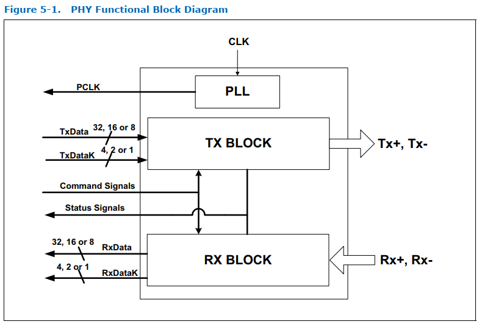
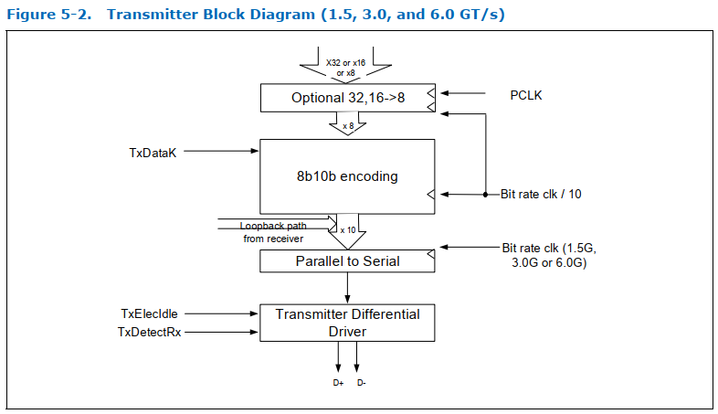
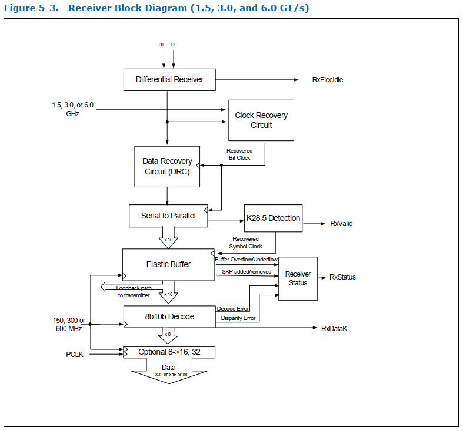

# 5. SATA PHY Functionality

图 5-1 展示了一个 SATA PHY 的功能框图。图中所示的功能模块并非用于定义符合规范的 PHY 的内部架构或具体设计，而是用于辅助理解信号的分组关系。

下面各节对图 5-1 中的功能模块进行了详细说明。这些模块反映了 PHY 实现中必需的核心功能。说明文字和示意图展示了总体架构及行为特性，而具体的实现方式可以有所不同，均属于规范允许的设计方案

 

