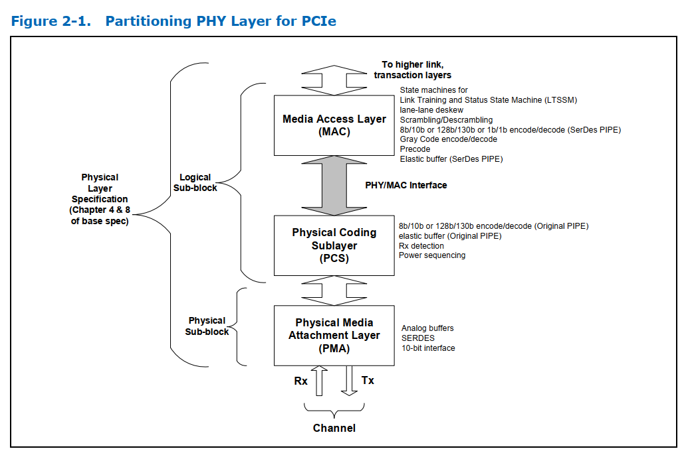
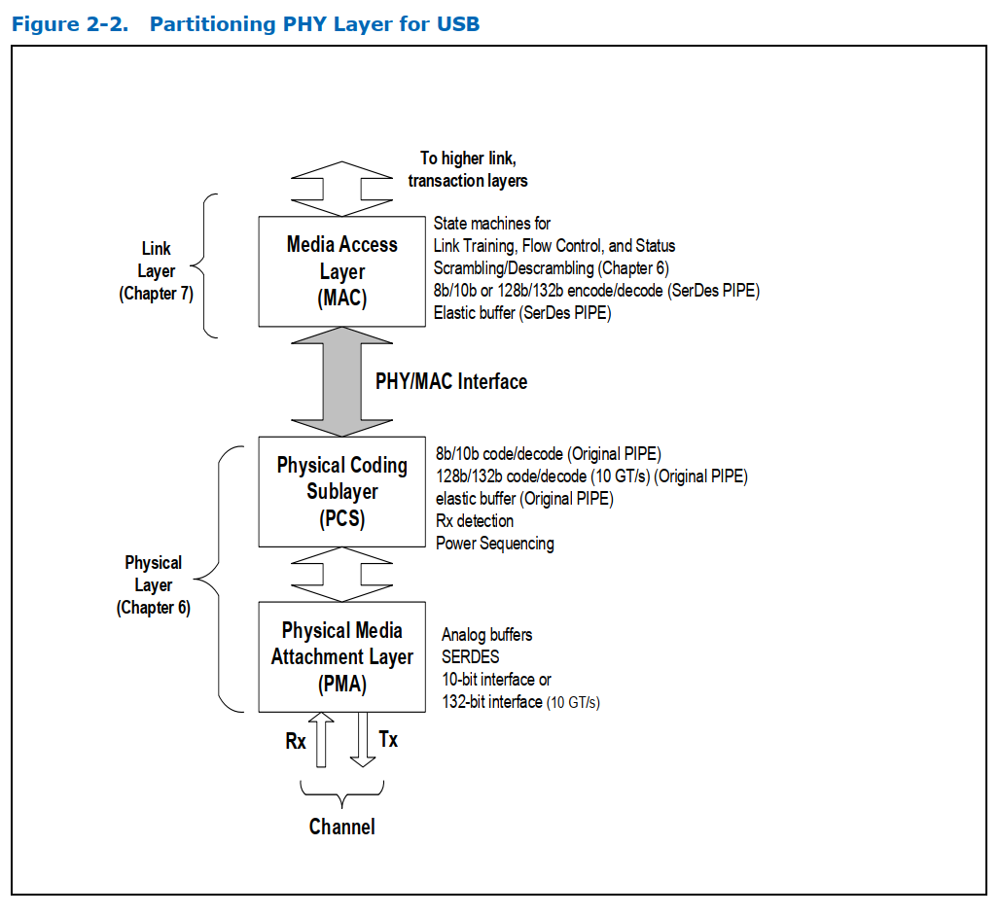
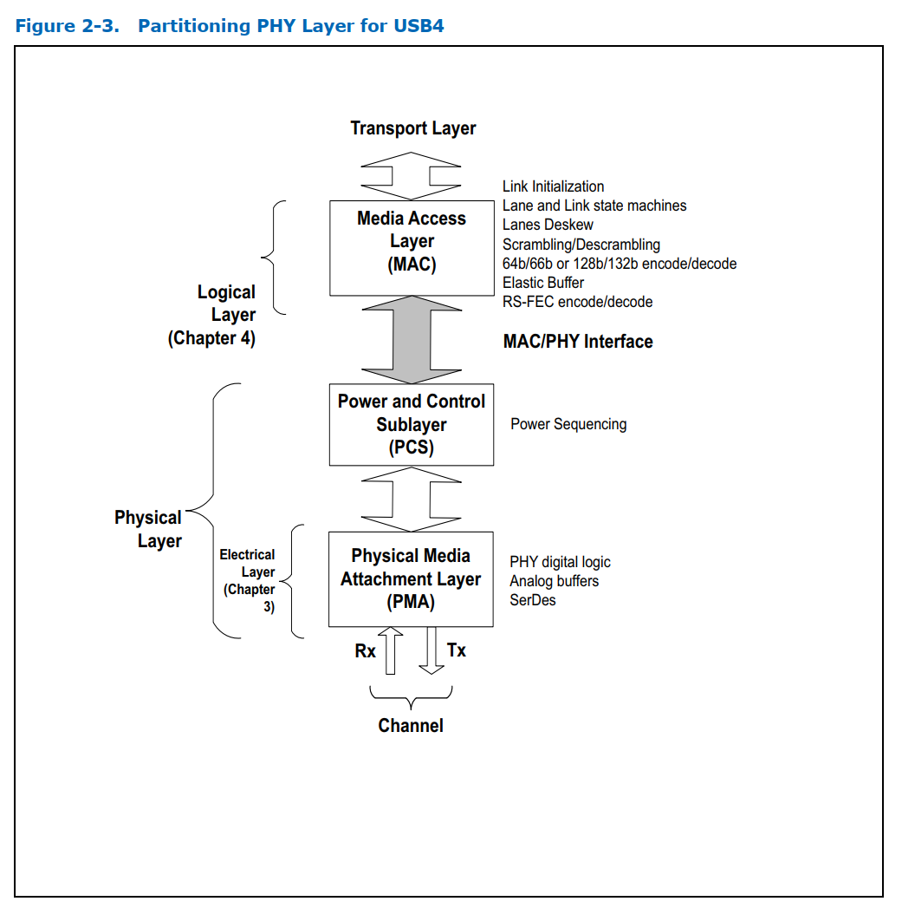

# 2. Introduction

PCI Express、SATA、USB、DisplayPort 和Converged IO 的 PIPE 接口旨在实现功能等效的 PCI Express、SATA、USB、DisplayPort 和Converged IO PHY 的开发。此类 PHY 可以作为独立集成电路或macrocell交付，用于 ASIC 设计。该规范定义了一组符合 PIPE 标准的 PHY 所必须的功能，并定义了该 PHY 与媒体接入层（MAC）及链路层 ASIC 之间的标准接口。本规范的目的并非定义符合标准的 PHY 芯片或macrocell的内部架构或设计。PIPE 规范的定义允许使用多种方法。在可能的情况下，PIPE 规范引用 PCI Express 基础规范、SATA 3.0 规范、USB 3.1 规范、DisplayPort 1.4 规范或 Converged IO 1.0 规范，而不是重复其内容。如有冲突，以PCI-Express 基础规范、SATA 3.0 规范、USB 3.1 规范、DisplayPort 1.3 规范和 Converged IO 1.0 规范为准。

本规范提供了关于 MAC 如何利用 PIPE 接口处理各种 LTSSM 状态、链路状态及其他协议的信息。这些信息应被视为`guidelines for`或`one way to implement`。只要符合相应的规范要求，MAC 可以自由以其他方式实现。

PIPE 规范的一项目的是加速 PCI Express endpoint、SATA 设备、USB 设备和Converged IO 设备的开发。本文档定义了 ASIC 和 endpoint 设备厂商可以开发的接口。外设和 IP 厂商能够开发和验证其设计，免受 PCI Express、SATA、USB、DisplayPort 或Converged IO PHY 接口相关的高速和模拟电路问题影响，从而最大限度地减少开发周期的时间和风险。

PIPE 规范为接口定义了两种时钟选项。第一种选择中，PHY 提供一个时钟（PCLK），将 PIPE 接口作为输出时钟。在第二种方案中，PCLK 作为输入被提供给 PHY 的每个通道。另一种方案是在 PHY 的 4.1 版本中加入的，即在 PHY 的每个 lane 上提供 PCLK。它允许 PHY 外部的控制器或逻辑更轻松地调整 PIPE 接口的时序，以满足芯片实现的时序要求。PHY 只需支持其中一种定时方案。这两种时钟选项分别称为`“PCLK as PHY Output”`和`“PCLK as PHY Input”`。DisplayPort 只支持`“PCLK as PHY Input”`时钟选项。**注意：`“PCLK as PHY Output”` 模式不支持 PCIe 5.0 及以后版本、Converged IO或 Displayport.**

图 2‑1：PCI Express 物理层（PHY Layer）划分，展示了本规范针对PCI Express 基础规范所描述的划分方式。

图 2-2 展示了本规范中描述的 USB 3.1 规范划分。

图 2-3 展示了本规范中针对Converged IO 1.0 规范描述的划分方式。

## 2.1 PCI Express PHY Layer

PCIe PHY 的一些关键特性包括：

## 2.2 USB PHY Layer

USB PHY 的一些关键特性包括：

## 2.3 USB4 PHY Layer

## 2.4 SATA PHY Layer

## 2.5 DisplayPort PHY Layer

## 2.6 Low Pin Count Interface and SerDes Architecture

