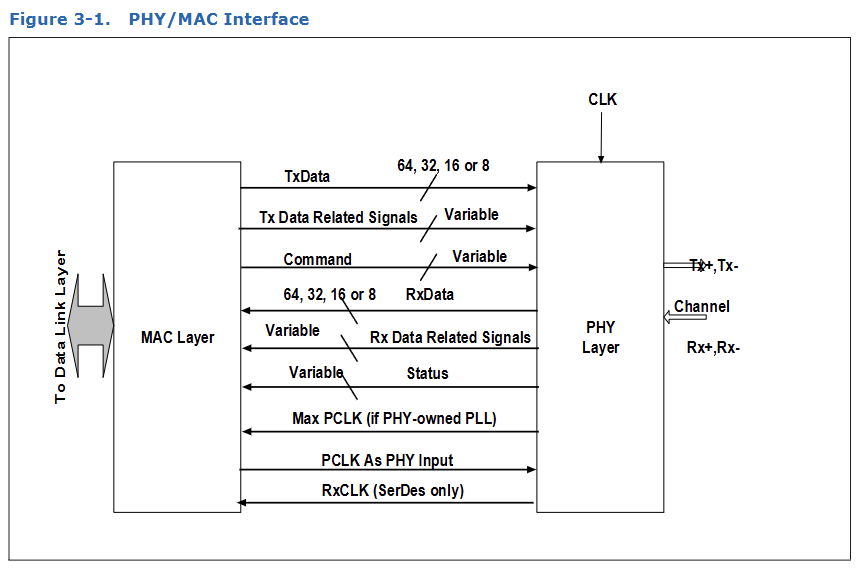
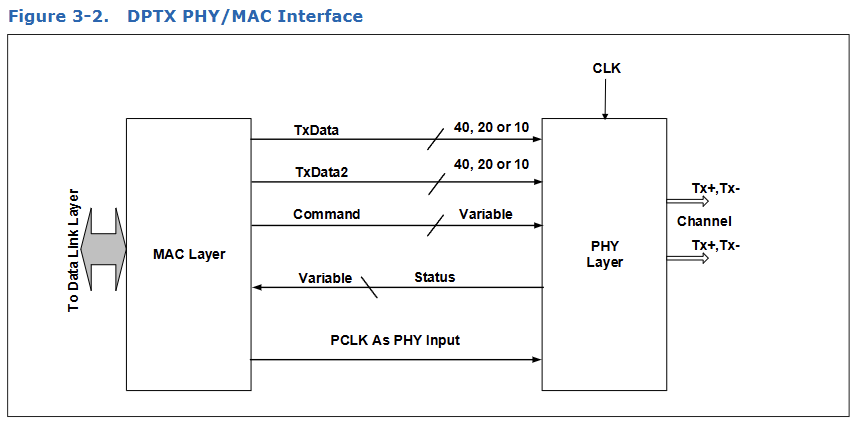
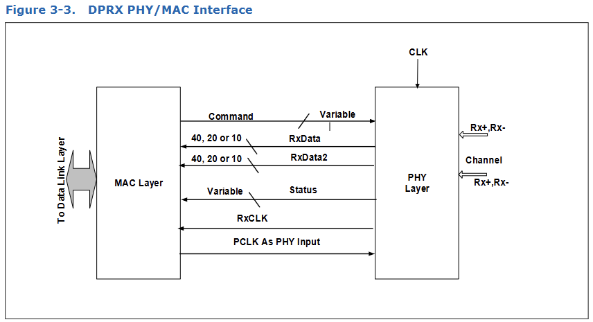

# 3. PHY/MAC Interface

图 3-1 显示了 PHY 与 MAC 层之间一对 TX 和 RX 组合情况下的**数据**、**命令**和**状态**信号。

图 3-2 和图 3-3 分别展示了 DisplayPort DPTX 和 DPRX 在 PHY 与 MAC 层之间的**数据**、**命令**和**状态**信号。如果想要在所有速率下完全支持 PCIe 模式、USB 模式、SATA 模式、DisplayPort 模式和 USB4 模式，需要实现不同数量的控制和状态信号。详见第 6.1 节，了解每种工作模式需要哪些具体信号。

本规范允许多种不同的 PHY/MAC 接口配置以支持多种信号速率。

对于仅支持 PCIe 2.5 GT/s 速率的 PIPE 实现，可以选择 16 位数据路径实现，PCLK 运行于 125 MHz，或 8 位数据路径，PCLK 运行 250 MHz。支持 5.0 GT/s 和 2.5 GT/s 的 PCIe 模式 PIPE 实现， 可以在 2.5 GT/s 和 5.0 GT/s 之间切换信号速率，实现方式多种。一个

Table 3-1. PCIe Mode - Possible PCLK Rates and Data Width
| Mode      | PCLK     | Original PIPE Data Width (SerDes Data Width ) | TXDataValid and RXDataValid Strobe Rate |
| --------- | -------- | --------------------------------------------- | --------------------------------------- |
| 2.5 GT/s  | 4000 MHz | 8bits  (10 bits)                              | 1 in 16 PCLKS                           |
| 2.5 GT/s  | 4000 MHz | 8 bits (10 bits)                              | 1 in 16 PCLKs                           |
| 2.5 GT/s  | 2000 MHz | 8 bits (10 bits)                              | 1 in 8 PCLKs                            |
| 2.5 GT/s  | 1000 MHz | 8 bits (10 bits)                              | 1 in 4 PCLKs                            |
| 2.5 GT/s  | 500 MHz  | 8 bits (10 bits)                              | 1 in 2 PCLKs                            |
| 2.5 GT/s  | 250 MHz  | 8 bits (10 bits)                              | N/A                                     |
| 2.5 GT/s  | 2000 MHz | 16 bits (20 bits)                             | 1 in 16 PCLKs                           |
| 2.5 GT/s  | 500 MHz  | 16 bits (20 bits)                             | 1 in 4 PCLKs                            |
| 2.5 GT/s  | 250 MHz  | 16 bits (20 bits)                             | 1 in 2 PCLKs                            |
| 2.5 GT/s  | 125 MHz  | 16 bits (20 bits)                             | N/A                                     |
| 2.5 GT/s  | 250 MHz  | 32 bits (40 bits)                             | 1 in 4 PCLKs                            |
| 2.5 GT/s  | 62.5 MHz | 32 bits (40 bits)                             | N/A                                     |
| 2.5 GT/s  | 62.5 MHz | N/A (80 bits)                                 | 1 in 2 PCLKs                            |
| 5.0 GT/s  | 4000 MHz | 8 bits (10 bits)                              | 1 in 8 PCLKs                            |
| 5.0 GT/s  | 2000 MHz | 8 bits (10 bits)                              | 1 in 4 PCLKs                            |
| 5.0 GT/s  | 1000 MHz | 8 bits (10 bits)                              | 1 in 2 PCLKs                            |
| 5.0 GT/s  | 500 MHz  | 8 bits (10 bits)                              | N/A                                     |
| 5.0 GT/s  | 2000 MHz | 16 bits (20 bits)                             | 1 in 8 PCLKs                            |
| 5.0 GT/s  | 500 MHz  | 16 bits (20 bits)                             | 1 in 2 PCLKs                            |
| 5.0 GT/s  | 250 MHz  | 16 bits (20 bits)                             | N/A                                     |
| 5.0 GT/s  | 250 MHz  | 32 bits (40 bits)                             | 1 in 2 PCLKs                            |
| 5.0 GT/s  | 125 MHz  | 32 bits (40 bits)                             | N/A                                     |
| 5.0 GT/s  | 125 MHz  | N/A (80 bits)                                 | 1 in 2 PCLKs                            |
| 5.0 GT/s  | 62.5 MHz | N/A (80 bits)                                 | N/A                                     |
| 8.0 GT/s  | 4000 MHz | 8 bits (10 bits)                              | 1 in 4 PCLKs                            |
| 8.0 GT/s  | 2000 MHz | 8 bits (10 bits)                              | 1 in 2 PCLKs                            |
| 8.0 GT/s  | 2000 MHz | 32 bits (40 bits)                             | 1 in 8 PCLKs                            |
| 8.0 GT/s  | 1000 MHz | 8 bits (10 bits)                              | N/A                                     |
| 8.0 GT/s  | 1000 MHz | 16 bits (20 bits)                             | 1 in 2 PCLKs                            |
| 8.0 GT/s  | 1000 MHz | 32 bits (40 bits)                             | 1 in 4 PCLKs                            |
| 8.0 GT/s  | 500 MHz  | 16 bits (20 bits)                             | N/A                                     |
| 8.0 GT/s  | 500 MHz  | 32 bits (40 bits)                             | 1 in 2 PCLKs                            |
| 8.0 GT/s  | 250 MHz  | 32 bits (40 bits)                             | N/A                                     |
| 8.0 GT/s  | 250 MHz  | N/A (80 bits)                                 | 1 in 2 PCLKs                            |
| 8.0 GT/s  | 125 MHz  | N/A (80 bits)                                 | N/A                                     |
| 16.0 GT/s | 4000 MHz | 8 bits (10 bits)                              | 1 in 2 PCLKs                            |
| 16.0 GT/s | 2000 MHz | 8 bits (10 bits)                              | N/A                                     |
| 16.0 GT/s | 2000 MHz | 32 bits (40 bits)                             | 1 in 4 PCLKs                            |
| 16.0 GT/s | 1000 MHz | 16 bits (20 bits)                             | N/A                                     |
| 16.0 GT/s | 1000 MHz | 32 bits (40 bits)                             | 1 in 2 PCLKs                            |
| 16.0 GT/s | 500 MHz  | 32 bits (40 bits)                             | N/A                                     |
| 16.0 GT/s | 250 MHz  | N/A (80 bits)                                 | N/A                                     |
| 32 GT/s   | 4000 MHz | 8 bits (10 bits)                              | N/A                                     |
| 32 GT/s   | 2000 MHz | 16 bits (20 bits)                             | N/A                                     |
| 32 GT/s   | 2000 MHz | 32 bits (40 bits)                             | 1 in 2 PCLKs                            |
| 32 GT/s   | 1000 MHz | 32 bits (40 bits)                             | N/A                                     |
| 32 GT/s   | 500 MHz  | N/A (80 bits)                                 | N/A                                     |
| 64 GT/s   | 4000 MHz | N/A (20 bits)                                 | N/A                                     |
| 64 GT/s   | 2000 MHz | N/A (40 bits)                                 | N/A                                     |
| 64 GT/s   | 2000 MHz | N/A (80 bits)                                 | 1 in 2 PCLKs                            |
| 64 GT/s   | 1000 MHz | N/A (80 bits)                                 | N/A                                     |
| 128 GT/s  | 4000 MHz | N/A (40 bits)                                 | N/A                                     |
| 128 GT/s  | 2000 MHz | N/A (80 bits)                                 | N/A                                     |
| 128 GT/s  | 1000 MHz | N/A (160 bits)                                | N/A                                     |
