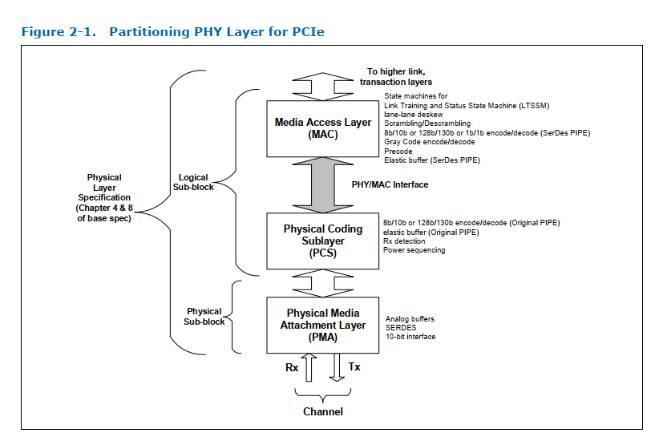

# 2. Introduction

PCI Express*（PCIe*）、SATA、USB1、DisplayPort和USB4的物理层接口架构（PIPE）旨在支持功能开发相当于PCIe、SATA、USB、DisplayPort和USB4的物理层。此类PHY可以以离散集成电路（IC）或macrocell的形式交付，用于集成专用集成电路（ASIC）设计。该规范定义了一组PIPE合规PHY必须集成的物理层功能；此外还定义了物理层（PHY）与媒体访问控制层（MAC）及链路层之间的标准接口专用集成电路。本规范旨在定义ASIC的内部架构或设计符合标准的物理层芯片或宏单元。

